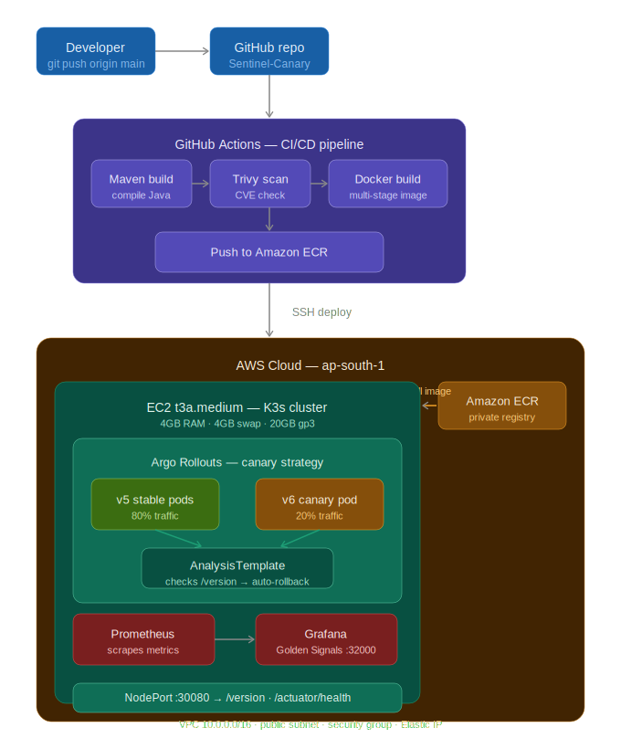
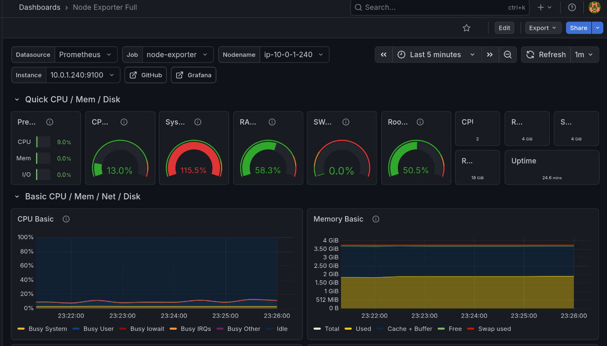
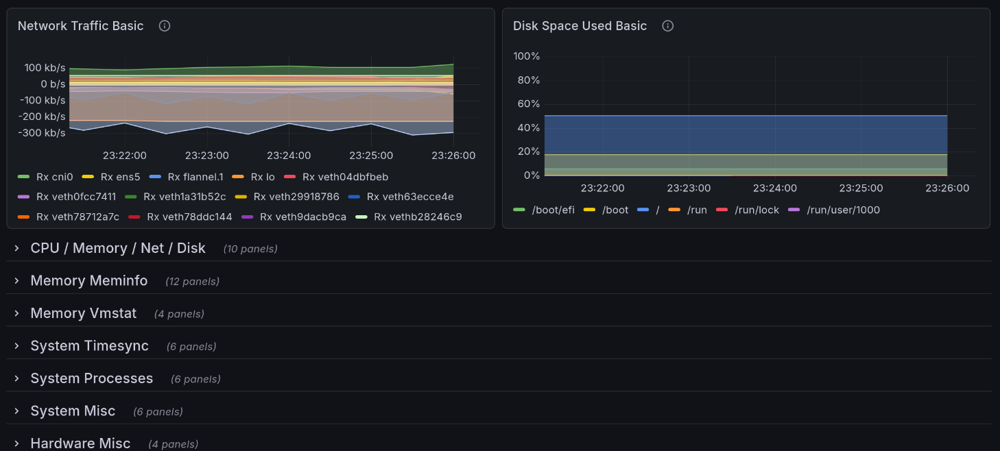

# 🛡️ Sentinel Canary

> A production-grade, self-healing deployment platform built from scratch on AWS — featuring zero-downtime canary releases, automated rollback, and real-time observability.

---

## What happens when you `git push`?

```
Your laptop                 GitHub                    AWS ap-south-1
──────────                  ──────                    ──────────────
git push ──────────────────► Actions runner ──────────► EC2 t3a.medium
                             │                          │
                             ├─ Maven compiles Java      ├─ Argo Rollouts
                             ├─ Trivy scans for CVEs     │   ├─ 20% traffic → new pod
                             ├─ Docker multi-stage build  │   ├─ wait 1 min, check /version
                             └─ Push image to ECR ───────►│   ├─ 50% → wait → 100%
                                                          │   └─ 500 error? auto-rollback
                                                          │
                                                          └─ Grafana shows it all live
```

One `git push`. No manual steps. If the new version is broken, the system heals itself.

---

## Architecture



---
## Live Grafana Dashboard




---
## Tech Stack

| Layer | Technology | Why this, not the alternative |
|-------|-----------|-------------------------------|
| Infrastructure | Terraform + AWS | Reproducible IaC — entire cluster rebuilt in 5 minutes |
| Compute | EC2 t3a.medium + K3s | EKS costs $72/month just for the control plane. K3s = $0 |
| Registry | AWS ECR | Private, IAM-secured, lifecycle policy keeps only last 3 images |
| App | Spring Boot 3.4 / Java 21 | Actuator health endpoints work out-of-the-box for K8s probes |
| Container | Multi-stage Dockerfile | JRE-Alpine runtime: 150MB final image vs 500MB with JDK |
| CI/CD | GitHub Actions | Free for public repos, native secrets management |
| Security | Trivy | Shift-left CVE scanning before the image reaches ECR |
| Deployment | Argo Rollouts | Canary traffic splitting with metric-based auto-rollback |
| Monitoring | Prometheus + Grafana | Golden Signals dashboard — latency, traffic, errors, saturation |

---

## The SRE Decisions That Matter

Most projects list tools. Here's why each decision was made.

### Why K3s instead of EKS?
EKS charges $0.10/hour for the managed control plane — $72/month before a single pod runs. K3s runs the full Kubernetes API server on the same EC2 instance at zero additional cost. For a single-node learning/portfolio environment, K3s gives identical operational experience at a fraction of the cost.

### Why JRE-Alpine instead of JDK in the Docker image?
JDK includes the compiler, debugger, and profiling tools. In production you only ever *run* compiled code — you never compile on the server. JRE-Alpine strips everything except the runtime, reducing the final image from ~500MB to ~150MB. Smaller image = faster ECR pulls during deployments = smaller attack surface for CVEs.

### Why Canary instead of Rolling Update?
Kubernetes Rolling Update replaces all pods simultaneously. If a bug slips through, 100% of users hit broken code before anyone notices. With Argo Rollouts canary strategy, only 20% of traffic goes to the new version first. If the AnalysisTemplate detects HTTP 500 errors — Argo aborts and rolls back automatically. The other 80% of users never notice the bad deployment.

### Why 4GB Swap on a 4GB RAM instance?
K3s control plane uses ~500MB. Spring Boot JVM uses ~300MB. The OS takes ~200MB. That's ~1GB at idle — fine. But during canary deployments, both old and new pods run simultaneously, doubling memory usage. Without swap, the Linux OOM killer fires and takes down the K3s control plane. With 4GB swap, the node survives memory spikes safely.

### Why gp3 instead of gp2 EBS?
gp3 provides 3,000 IOPS baseline at lower cost than gp2 with its variable IOPS. AWS now recommends gp3 as the default for all new volumes. No configuration needed — better performance, lower price.

### Why NodePort instead of LoadBalancer?
LoadBalancer type provisions an AWS ALB — which costs money even when idle. NodePort exposes the service directly on the EC2 host port 30080 at zero cost. For a single-node cluster, NodePort gives identical external access without the overhead.

---

## Canary Deployment — How It Works

```
Deploy v6 via git push
        │
        ▼
Argo creates v6 canary pod (1 pod)
        │
        ▼
20% of requests → v6    80% → v5 (stable)
        │
   AnalysisTemplate checks /version every 30s
        │
   ┌────┴────┐
   │         │
status=healthy   status=500 error
   │         │
   ▼         ▼
50% → 100%   ABORT → rollback to v5
   Complete   80% users never noticed
```

This was tested live — pushed a version that throws `RuntimeException` on every request. Argo detected the 500 errors via AnalysisTemplate, aborted at 20%, and reverted to stable automatically. No human intervention.

---

## Observability — Golden Signals

Prometheus scrapes cluster metrics every 15 seconds. Grafana renders them on the Node Exporter Full dashboard (ID: 1860).

**Steady-state readings on t3a.medium:**

| Signal | Value | What it means |
|--------|-------|---------------|
| CPU | 10-13% | Healthy headroom for traffic spikes |
| Memory | 57% | K3s + Spring Boot + OS at idle |
| Swap | 0% | Memory never under pressure — good sign |
| Disk | 50% | 10GB used of 20GB gp3 |

---

## Project Structure

```
Sentinel-Canary/
├── Dockerfile                      # Multi-stage: Maven build → JRE-Alpine runtime
├── infra/
│   ├── main.tf                     # EC2, ECR, EIP, Security Group
│   └── vpc.tf                      # VPC, subnet, IGW, route table
├── sentinel-app/
│   └── src/main/java/
│       └── com/krish/sentinelapp/
│           └── controller/
│               └── VersionController.java
├── k8s/
│   ├── rollout.yaml                # Argo Rollouts canary strategy
│   ├── service.yaml                # NodePort :30080
│   └── analysis-template.yaml     # Auto-rollback rules
├── .github/
│   └── workflows/
│       └── deploy.yml              # Full CI/CD pipeline
└── docs/
    └── architecture.svg            # System architecture diagram
```

---

## API Endpoints

| Endpoint | Response | Purpose |
|----------|----------|---------|
| `GET /version` | `{"version":"v5","color":"green","status":"healthy"}` | Canary traffic detection |
| `GET /actuator/health` | `{"status":"UP","groups":["liveness","readiness"]}` | K8s health check |
| `GET /actuator/health/liveness` | `{"status":"UP"}` | Liveness probe — restart if failing |
| `GET /actuator/health/readiness` | `{"status":"UP"}` | Readiness probe — remove from LB if failing |

---

## CI/CD Pipeline Steps

```yaml
1. Checkout code
2. Setup Java 21 (Temurin)
3. Maven build → sentinel-app/target/*.jar
4. Configure AWS credentials (via GitHub Secrets)
5. Login to Amazon ECR
6. Docker build → image tagged with github.run_number
7. Trivy scan → report CRITICAL/HIGH CVEs
8. Push image to ECR
9. Install AWS CLI + Argo controller on server (idempotent)
10. SCP k8s manifests to server
11. kubectl apply analysis-template + rollout + service
12. kubectl argo rollouts status --timeout=300s
```

---

## Morning Rebuild Sequence

```bash
# 1. Rebuild infrastructure (5 minutes)
cd infra && terraform apply -auto-approve

# 2. Create ECR pull secret (manual — expires every 12h)
PASS=$(aws ecr get-login-password --region ap-south-1)
ssh -i ~/.ssh/sentinel-key.pem ubuntu@$(terraform output -raw fixed_public_ip) \
  "sudo kubectl create secret docker-registry ecr-registry-key \
  --docker-server=408834627625.dkr.ecr.ap-south-1.amazonaws.com \
  --docker-username=AWS --docker-password=$PASS"

# 3. Trigger pipeline
git commit --allow-empty -m "chore: trigger deploy" && git push origin main

# 4. Verify
curl http://$(terraform output -raw fixed_public_ip):30080/version
```

---

## Cost Estimate

| Resource | Rate | Daily (8h) |
|----------|------|-----------|
| EC2 t3a.medium | $0.034/hr | $0.27 |
| EBS 20GB gp3 | $0.002/hr | $0.016 |
| ECR storage | ~$0.001/GB | negligible |
| **Total** | | **~$0.29/day** |

> Infrastructure is destroyed every night with `terraform destroy`. Total project cost across all development days: under $3.

---

## What I Learned

Building this from scratch — not following a tutorial — taught things no course covers:

- **Docker build context** is what gets sent to the daemon, not the Dockerfile location. A misconfigured `.gitignore` silently excludes `src/` and produces an empty jar with no error.
- **Linux home directory permissions** (`drwx------`) block the Docker daemon from reading files even as root. The fix is building from `/tmp` or `chmod 755 ~`.
- **K3s caches images aggressively**. `kubectl rollout restart` doesn't force a new pull if the tag hasn't changed. `crictl rmi` on the server is the nuclear option.
- **ECR tokens expire every 12 hours**. Any pipeline that doesn't refresh `ecr-registry-key` before deploying will silently fail with `ErrImagePull`.
- **Argo Rollouts AnalysisTemplate** queries need the metric to actually exist. Querying `http_requests_total` when Micrometer isn't configured returns empty Prometheus results — which Argo treats as an error, causing false rollbacks. Web provider checking `/version` directly is more reliable for this stack.

---

## Author

**Krish** — 3rd year ECE student building production SRE skills from first principles.

GitHub: [@krishjj8](https://github.com/krishjj8)
